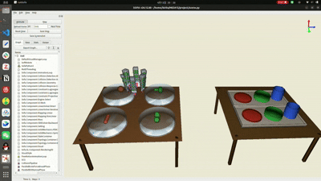

# ME5415 — Food Tray Assembly (SOFA)

A SOFA simulation that demonstrates a **6-finger PneuNet soft
pneumatic gripper** picking food items from a *Source Table* and
placing them on trays on an *Assembly Table*, in the spirit of the
food-tray assembly manipulation challenge.



## Files

| File | Purpose |
|------|---------|
| `scene.py` | Top-level scene: plugins, pipelines, tables, food spawns, gripper + controller hookup |
| `gripper.py` | 6-finger PneuNet soft gripper (hooked fingertips, FEM silicone) |
| `food.py` | Deformable / visual food factory + per-food FEM parameters |
| `tables.py` | Source + Assembly tables, wooden legs, transparent bowls, trays, procedural cylinders |
| `gripper_controller.py` | `Sofa.Core.Controller`: Ctrl-key movement + contact-force CSV log |
| `run.sh` | Launcher (forces `-g qt`, sets `LD_LIBRARY_PATH` for SofaPython3) |
| `object/mesh/` | Mesh assets (food STL/VTK + gripper VTK/STL + table plane) |
| `REPORT.md` | Project report (design, compliance, food coverage, limitations) |
| `contact_forces.csv` | Runtime log (step, time, pressure, force norm, per-finger XYZ) |
| `scene.py.view` | Saved camera view (reloaded automatically by runSofa) |

## How to run

```bash
./run.sh
```

This opens the scene in `runSofa` with the Qt GUI. Press **Animate**
in the top-left panel to start the simulation, then click the 3D
viewport so it has keyboard focus before using any of the controls
below.

## Controls

**Important:** runSofa only forwards key events to Python controllers
when the **Ctrl modifier is held**, so every key below must be
pressed as `Ctrl + key`.

| Key | Action |
|-----|--------|
| `Ctrl + Space` | Inflate cavities → fingers curl in (close) |
| `Ctrl + -`     | Deflate cavities → fingers open |
| `Ctrl + ↑` / `Ctrl + ↓` | Move gripper up / down (along ±X) |
| `Ctrl + A` / `Ctrl + D` | Move gripper left / right (-Z / +Z) |
| `Ctrl + W` / `Ctrl + S` | Move gripper forward / back (-Y / +Y) |

Recording flow: click the 3D viewport, press **Animate**, wait for
the food to settle into its bowls, then drive the gripper with the
Ctrl-key combinations above to demonstrate the grasp → lift →
traverse → release cycle.

## Scene contents

* **Source Table** — wooden table-top on four legs, four round
  translucent plastic bowls in a 2×2 grid. Each bowl holds one food:
  meatball, sausage, broccoli, four-bean.
* **Assembly Table** — wooden table-top on four legs, two identical
  empty trays with raised rims. Each tray has three circular
  compartments built procedurally from cylinders: a **red plate**, a
  **green bowl**, and a **blue cup**.
* **Food items** — four deformable FEM bodies (`meatball`, `sausage`,
  `broccoli`, `bean`). Young's modulus is tuned per food so compliance
  behaviour is visually distinct:
  * meatball & broccoli ≈ 1500 MPa (near-rigid solids)
  * sausage = 30 MPa (firm, for numerical stability)
  * four-bean = 0.6 MPa (very soft, cooked)
* **Soft gripper** — six PneuNet FEM fingers arranged radially around
  the central axis, driven by a `SurfacePressureConstraint` on each
  internal air cavity. Two-layer silicone (`E = 590` bulk +
  `E = 5500` stiff backbone) produces the characteristic bending.
  Fingertips have hooked **pink** caps for extra grip on round
  objects. Initial cavity pressure is 0.05 so the gripper starts
  slightly pre-curled.

## Environment setup

This project has been tested on Linux with Python 3.12 in a conda
environment. The launcher (`run.sh`) assumes you have:

1. **SOFA v24.12** extracted to
   `~/sofa-install/extracted/SOFA_v24.12.00_Linux/` with the
   **SofaPython3**, **SoftRobots** and **MultiThreading** plugins
   (they ship with the binary release — no extra download needed).
   Grab it from
   <https://www.sofa-framework.org/download/> (binary release for
   Linux, v24.12.00).

2. A **conda environment named `sofa`** providing `libpython3.12`
   that `libSofaPython3.so` can dlopen. Reproduce it with:

   ```bash
   conda env create -f environment.yml
   # or, equivalently:
   conda create -n sofa -c conda-forge python=3.12 numpy scipy
   ```

   `numpy` is used by `gripper_controller.py` for the
   contact-force log; `scipy` is pulled in by some SOFA Python
   modules on import.

3. Edit `run.sh` if your SOFA or conda paths differ from the
   defaults (`SOFA_ROOT` and `PYLIB_DIR` at the top of the file).

The launcher prepends `$PYLIB_DIR` to `LD_LIBRARY_PATH` and passes
`-g qt -l SofaPython3` to `runSofa`, which is the combination that
reliably forwards Ctrl-key events from the GUI to the Python
controller in SOFA 24.12.

## Notes

* The scene uses `ParallelBruteForceBroadPhase`,
  `ParallelBVHNarrowPhase` and `ParallelTetrahedronFEMForceField` for
  multi-threaded CPU. GPU (`SofaCUDA`) was evaluated but not adopted —
  the bottleneck is the constraint solver, which has no CUDA port.
* Food meshes for the other five task categories (`carrot`, `cookie`,
  `cup`, `eggs`, `spaghetti`) are kept in `object/mesh/` and
  their FEM parameters live in `food.py:FOOD_PARAMS`, so swapping an
  active food in the scene is a one-line change in `scene.py`.
